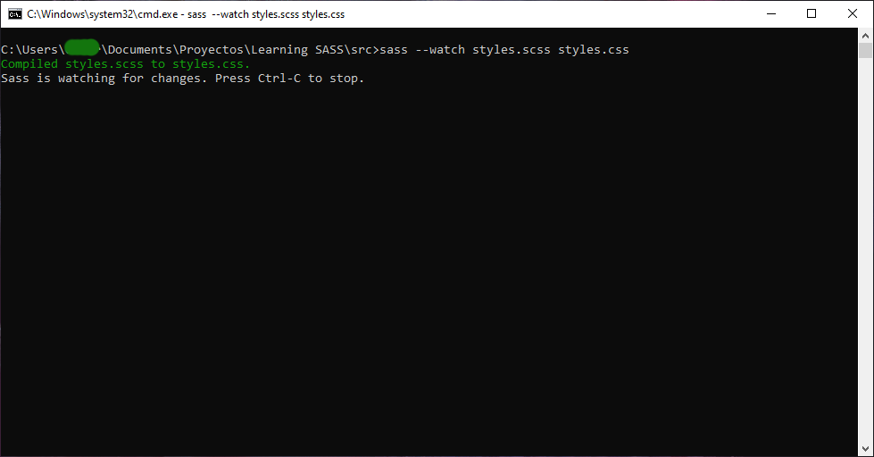

<p align="center">
   <a href=""></a>  
</p>
<h1 align="center">Learning SASS</h1>
<p align="center">A project to practice SASS</p>

## 📦 Instalation
```
npm init 

npm i sass
```

## 💻 Compiling
<a href=""></a>
<p align="center">// You have to compile the file because html cannot read SASS, With this command you compile the file .scss to a .css \\</p>

## 📱 Links
- [Website]()
- [Code](src/styles.scss)

## 👤 Stay in touch
- [Website](https://elmarcz.github.io/portfolio/)
- [Twitter](https://twitter.com/MarcMedrano15)
- [Discord](https://discord.com/invite/zPSYDGVXxx)
- [Instagram](https://www.instagram.com/marcmedranoz/)

### Made with ❤ by Marc Medrano
